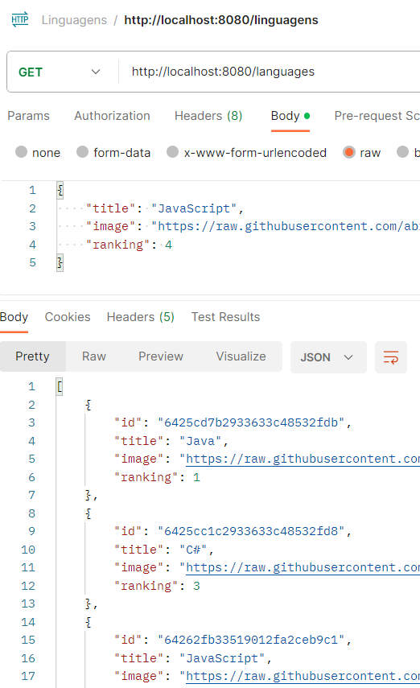

# Languages API (Alura exercise)

Spring project that consists on generating a **REST API** that interacts with a MongoDB database. The program allows the user to update and maintain a list of languages. It is intended to work with a project such as [Sticker Generator](https://github.com/mackeriv/alura-stickers), providing it with relevant content:

This was an exercise for learning how to code, part of the **Imersão JAVA** mini-course from Alura (2023 edition).
